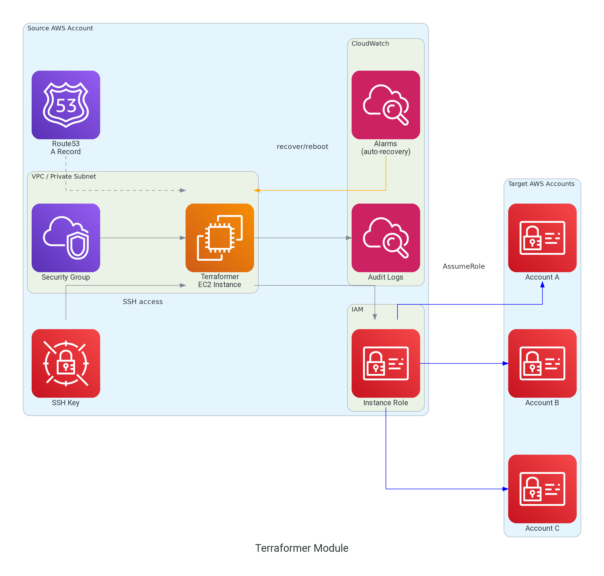

# terraform-aws-terraformer

[](https://infrahouse.com/contact)
[](https://infrahouse.github.io/terraform-aws-terraformer/)
[](https://registry.terraform.io/modules/infrahouse/terraformer/aws/latest)
[](https://github.com/infrahouse/terraform-aws-terraformer/releases/latest)
[](https://aws.amazon.com/ec2/)
[](https://github.com/infrahouse/terraform-aws-terraformer/actions/workflows/vuln-scanner-pr.yml)
[](LICENSE)

A Terraform module that provisions a dedicated EC2 instance for administrative Terraform operations in AWS.

## Overview

The Terraformer is a secure, centralized EC2 instance designed for running Terraform operations 
that require elevated permissions, such as:

- Fixing corrupted Terraform state
- Running infrastructure migrations
- Performing maintenance tasks that require cross-account or cross-service access
- Executing Terraform operations in environments where direct access is restricted

The module provisions an Ubuntu-based EC2 instance with:

- **IAM Role with AssumeRole capabilities** - Enables the instance to assume other roles for multi-account operations
- **DNS registration** - Automatically creates a Route53 record for easy access
- **Security Group** - Configured with SSH access and ICMP for troubleshooting
- **CloudWatch monitoring** - Includes CPU utilization alarms
- **Customizable configuration** - Support for custom packages, files, and Puppet configuration

The module outputs the IAM role ARN and name, allowing you to reference it in trust policies of other roles
that the Terraformer needs to assume.

## Architecture



## Usage

```hcl
module "terraformer" {
  source  = "registry.infrahouse.com/infrahouse/terraformer/aws"
  version = "1.0.1"

  ssh_key_name = aws_key_pair.test.key_name
  zone_id      = data.aws_route53_zone.test_zone.zone_id
  subnet       = var.subnet_private_ids[0]
}
```

<!-- BEGIN_TF_DOCS -->

## Requirements

| Name | Version |
|------|---------|
| <a name="requirement_terraform"></a> [terraform](#requirement\_terraform) | ~> 1.5 |
| <a name="requirement_aws"></a> [aws](#requirement\_aws) | >= 5.11, < 7.0 |
| <a name="requirement_null"></a> [null](#requirement\_null) | >= 3.2.0 |
| <a name="requirement_random"></a> [random](#requirement\_random) | >= 3.5.0 |
| <a name="requirement_time"></a> [time](#requirement\_time) | >= 0.9.0 |
| <a name="requirement_tls"></a> [tls](#requirement\_tls) | >= 4.0.0 |

## Providers

| Name | Version |
|------|---------|
| <a name="provider_aws"></a> [aws](#provider\_aws) | >= 5.11, < 7.0 |
| <a name="provider_null"></a> [null](#provider\_null) | >= 3.2.0 |
| <a name="provider_random"></a> [random](#provider\_random) | >= 3.5.0 |
| <a name="provider_time"></a> [time](#provider\_time) | >= 0.9.0 |
| <a name="provider_tls"></a> [tls](#provider\_tls) | >= 4.0.0 |

## Modules

| Name | Source | Version |
|------|--------|---------|
| <a name="module_profile"></a> [profile](#module\_profile) | registry.infrahouse.com/infrahouse/instance-profile/aws | 1.9.0 |
| <a name="module_terraformer_ssh_key"></a> [terraformer\_ssh\_key](#module\_terraformer\_ssh\_key) | registry.infrahouse.com/infrahouse/secret/aws | 1.1.1 |
| <a name="module_userdata"></a> [userdata](#module\_userdata) | registry.infrahouse.com/infrahouse/cloud-init/aws | 2.2.2 |

## Resources

| Name | Type |
|------|------|
| [aws_cloudwatch_log_group.terraformer](https://registry.terraform.io/providers/hashicorp/aws/latest/docs/resources/cloudwatch_log_group) | resource |
| [aws_cloudwatch_metric_alarm.cpu_utilization_alarm](https://registry.terraform.io/providers/hashicorp/aws/latest/docs/resources/cloudwatch_metric_alarm) | resource |
| [aws_cloudwatch_metric_alarm.terraformer_instance_check](https://registry.terraform.io/providers/hashicorp/aws/latest/docs/resources/cloudwatch_metric_alarm) | resource |
| [aws_cloudwatch_metric_alarm.terraformer_system_auto_recovery](https://registry.terraform.io/providers/hashicorp/aws/latest/docs/resources/cloudwatch_metric_alarm) | resource |
| [aws_instance.terraformer](https://registry.terraform.io/providers/hashicorp/aws/latest/docs/resources/instance) | resource |
| [aws_key_pair.terraformer](https://registry.terraform.io/providers/hashicorp/aws/latest/docs/resources/key_pair) | resource |
| [aws_route53_record.terraformer](https://registry.terraform.io/providers/hashicorp/aws/latest/docs/resources/route53_record) | resource |
| [aws_security_group.terraformer](https://registry.terraform.io/providers/hashicorp/aws/latest/docs/resources/security_group) | resource |
| [aws_sns_topic.terraformer_alarms](https://registry.terraform.io/providers/hashicorp/aws/latest/docs/resources/sns_topic) | resource |
| [aws_sns_topic_subscription.alarm_email](https://registry.terraform.io/providers/hashicorp/aws/latest/docs/resources/sns_topic_subscription) | resource |
| [aws_vpc_security_group_egress_rule.terraformer_outgoing](https://registry.terraform.io/providers/hashicorp/aws/latest/docs/resources/vpc_security_group_egress_rule) | resource |
| [aws_vpc_security_group_ingress_rule.icmp](https://registry.terraform.io/providers/hashicorp/aws/latest/docs/resources/vpc_security_group_ingress_rule) | resource |
| [aws_vpc_security_group_ingress_rule.terraformer_ssh](https://registry.terraform.io/providers/hashicorp/aws/latest/docs/resources/vpc_security_group_ingress_rule) | resource |
| [aws_vpc_security_group_ingress_rule.terraformer_ssh_extra](https://registry.terraform.io/providers/hashicorp/aws/latest/docs/resources/vpc_security_group_ingress_rule) | resource |
| [null_resource.terraformer](https://registry.terraform.io/providers/hashicorp/null/latest/docs/resources/resource) | resource |
| [random_string.profile-suffix](https://registry.terraform.io/providers/hashicorp/random/latest/docs/resources/string) | resource |
| [time_rotating.ssh_key_rotation](https://registry.terraform.io/providers/hashicorp/time/latest/docs/resources/rotating) | resource |
| [time_static.ssh_key_rotation](https://registry.terraform.io/providers/hashicorp/time/latest/docs/resources/static) | resource |
| [tls_private_key.terraformer](https://registry.terraform.io/providers/hashicorp/tls/latest/docs/resources/private_key) | resource |
| [aws_ami.ubuntu_pro](https://registry.terraform.io/providers/hashicorp/aws/latest/docs/data-sources/ami) | data source |
| [aws_availability_zones.available](https://registry.terraform.io/providers/hashicorp/aws/latest/docs/data-sources/availability_zones) | data source |
| [aws_caller_identity.current](https://registry.terraform.io/providers/hashicorp/aws/latest/docs/data-sources/caller_identity) | data source |
| [aws_iam_policy_document.permissions](https://registry.terraform.io/providers/hashicorp/aws/latest/docs/data-sources/iam_policy_document) | data source |
| [aws_region.current](https://registry.terraform.io/providers/hashicorp/aws/latest/docs/data-sources/region) | data source |
| [aws_route53_zone.zone](https://registry.terraform.io/providers/hashicorp/aws/latest/docs/data-sources/route53_zone) | data source |
| [aws_subnet.selected](https://registry.terraform.io/providers/hashicorp/aws/latest/docs/data-sources/subnet) | data source |
| [aws_vpc.selected](https://registry.terraform.io/providers/hashicorp/aws/latest/docs/data-sources/vpc) | data source |

## Inputs

| Name | Description | Type | Default | Required |
|------|-------------|------|---------|:--------:|
| <a name="input_alarm_emails"></a> [alarm\_emails](#input\_alarm\_emails) | List of email addresses to receive CloudWatch alarm notifications. AWS SNS will send a confirmation email to each address - recipients MUST click the confirmation link to activate notifications. | `list(string)` | n/a | yes |
| <a name="input_ami"></a> [ami](#input\_ami) | Image for EC2 instances | `string` | `null` | no |
| <a name="input_cloudwatch_log_retention"></a> [cloudwatch\_log\_retention](#input\_cloudwatch\_log\_retention) | CloudWatch log group retention in days | `number` | `365` | no |
| <a name="input_cloudwatch_namespace"></a> [cloudwatch\_namespace](#input\_cloudwatch\_namespace) | CloudWatch namespace for custom metrics (convention: Service/Component) | `string` | `"Terraformer/System"` | no |
| <a name="input_dns_name"></a> [dns\_name](#input\_dns\_name) | Hostname of the Terraformer in zone var.zone\_id. | `string` | `"terraformer"` | no |
| <a name="input_environment"></a> [environment](#input\_environment) | Puppet environment. | `string` | n/a | yes |
| <a name="input_extra_files"></a> [extra\_files](#input\_extra\_files) | Additional files to create on an instance. | <pre>list(<br/>    object(<br/>      {<br/>        content     = string<br/>        path        = string<br/>        permissions = string<br/>      }<br/>    )<br/>  )</pre> | `[]` | no |
| <a name="input_extra_instance_profile_permissions"></a> [extra\_instance\_profile\_permissions](#input\_extra\_instance\_profile\_permissions) | A JSON with a permissions policy document. The policy will be attached to the instance profile. | `string` | `null` | no |
| <a name="input_extra_repos"></a> [extra\_repos](#input\_extra\_repos) | Additional APT repositories to configure on an instance. | <pre>map(<br/>    object(<br/>      {<br/>        source   = string<br/>        key      = string<br/>        machine  = optional(string)<br/>        authFrom = optional(string)<br/>        priority = optional(number)<br/>      }<br/>    )<br/>  )</pre> | `{}` | no |
| <a name="input_extra_ssh_cidrs"></a> [extra\_ssh\_cidrs](#input\_extra\_ssh\_cidrs) | Additional CIDR blocks to allow SSH access from (in addition to VPC CIDR). Useful for accessing from workstations or other networks. Note: Do not include CIDRs that overlap with the VPC CIDR as those are already allowed. | `list(string)` | `[]` | no |
| <a name="input_instance_type"></a> [instance\_type](#input\_instance\_type) | Terraformer EC2 instance will run on this type. | `string` | `"t3.micro"` | no |
| <a name="input_packages"></a> [packages](#input\_packages) | List of packages to install when the instance bootstraps. | `list(string)` | `[]` | no |
| <a name="input_puppet_custom_facts"></a> [puppet\_custom\_facts](#input\_puppet\_custom\_facts) | Custom facts for Puppet (will be merged with terraformer-specific facts) | `map(any)` | `{}` | no |
| <a name="input_puppet_debug_logging"></a> [puppet\_debug\_logging](#input\_puppet\_debug\_logging) | Enable debug logging if true. | `bool` | `false` | no |
| <a name="input_puppet_environmentpath"></a> [puppet\_environmentpath](#input\_puppet\_environmentpath) | A path for directory environments. | `string` | `"{root_directory}/environments"` | no |
| <a name="input_puppet_hiera_config_path"></a> [puppet\_hiera\_config\_path](#input\_puppet\_hiera\_config\_path) | Path to hiera configuration file. | `string` | `"{root_directory}/environments/{environment}/hiera.yaml"` | no |
| <a name="input_puppet_manifest"></a> [puppet\_manifest](#input\_puppet\_manifest) | Path to puppet manifest. By default ih-puppet will apply {root\_directory}/environments/{environment}/manifests/site.pp. | `string` | `null` | no |
| <a name="input_puppet_module_path"></a> [puppet\_module\_path](#input\_puppet\_module\_path) | Path to puppet modules. Colon-separated list searched in order. | `string` | `"{root_directory}/environments/{environment}/modules:{root_directory}/modules"` | no |
| <a name="input_puppet_root_directory"></a> [puppet\_root\_directory](#input\_puppet\_root\_directory) | Path where the puppet code is hosted. | `string` | `"/opt/puppet-code"` | no |
| <a name="input_root_volume_size"></a> [root\_volume\_size](#input\_root\_volume\_size) | Disk size in GB mounted as the root volume | `number` | `8` | no |
| <a name="input_smtp_credentials_secret"></a> [smtp\_credentials\_secret](#input\_smtp\_credentials\_secret) | AWS secret name with SMTP credentials. The secret must contain a JSON with user and password keys. | `string` | `null` | no |
| <a name="input_ssh_key_name"></a> [ssh\_key\_name](#input\_ssh\_key\_name) | SSH key name installed in the Terraformer instance. If not provided, a key pair will be auto-generated and rotated. | `string` | `null` | no |
| <a name="input_ssh_key_readers"></a> [ssh\_key\_readers](#input\_ssh\_key\_readers) | List of IAM role/user ARNs allowed to read the auto-generated SSH private key from Secrets Manager | `list(string)` | `null` | no |
| <a name="input_ssh_key_rotation_days"></a> [ssh\_key\_rotation\_days](#input\_ssh\_key\_rotation\_days) | Number of days before SSH key rotation when auto-generated | `number` | `90` | no |
| <a name="input_subnet"></a> [subnet](#input\_subnet) | Subnet id where the Terraformer instance will be created. | `string` | n/a | yes |
| <a name="input_ubuntu_codename"></a> [ubuntu\_codename](#input\_ubuntu\_codename) | Ubuntu version to use for the Terraformer instance | `string` | `"noble"` | no |
| <a name="input_zone_id"></a> [zone\_id](#input\_zone\_id) | Zone where the DNS record will be created. | `string` | n/a | yes |

## Outputs

| Name | Description |
|------|-------------|
| <a name="output_cloudwatch_log_group_name"></a> [cloudwatch\_log\_group\_name](#output\_cloudwatch\_log\_group\_name) | CloudWatch log group name for terraformer logs |
| <a name="output_cloudwatch_namespace"></a> [cloudwatch\_namespace](#output\_cloudwatch\_namespace) | CloudWatch namespace for custom metrics |
| <a name="output_hostname"></a> [hostname](#output\_hostname) | Fully qualified domain name of the Terraformer instance. |
| <a name="output_instance_id"></a> [instance\_id](#output\_instance\_id) | Instance id of terraformer ec2. |
| <a name="output_instance_role_arn"></a> [instance\_role\_arn](#output\_instance\_role\_arn) | ARN of the role assigned to the Terraformer instance. |
| <a name="output_instance_role_name"></a> [instance\_role\_name](#output\_instance\_role\_name) | Name of the role assigned to the Terraformer instance. |
| <a name="output_sns_topic_arn"></a> [sns\_topic\_arn](#output\_sns\_topic\_arn) | ARN of SNS topic for alarm notifications |
| <a name="output_ssh_key_secret_arn"></a> [ssh\_key\_secret\_arn](#output\_ssh\_key\_secret\_arn) | ARN of Secrets Manager secret containing auto-generated SSH private key (if applicable) |
<!-- END_TF_DOCS -->

## Documentation

For detailed documentation, visit the [GitHub Pages site](https://infrahouse.github.io/terraform-aws-terraformer/).

- [Getting Started](https://infrahouse.github.io/terraform-aws-terraformer/getting-started/)
- [Configuration](https://infrahouse.github.io/terraform-aws-terraformer/configuration/)
- [Architecture](https://infrahouse.github.io/terraform-aws-terraformer/architecture/)
- [Security](https://infrahouse.github.io/terraform-aws-terraformer/security/)
- [Troubleshooting](https://infrahouse.github.io/terraform-aws-terraformer/troubleshooting/)

## Examples

See the [test_data/terraformer](test_data/terraformer/) directory for a working example configuration.

## Contributing

Contributions are welcome! Please feel free to submit a Pull Request.

1. Fork the repository
2. Create your feature branch (`git checkout -b feature/amazing-feature`)
3. Run tests with `make test-clean`
4. Commit your changes
5. Push to the branch
6. Open a Pull Request

## License

This project is licensed under the Apache 2.0 License - see the [LICENSE](LICENSE) file for details.
